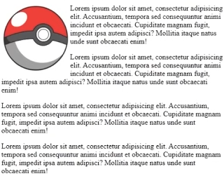

### Introdução

3 jeitos de aplicar CSS: Inline, Internal e External

Inline:

```
<body style="background-color: black">
	<h1 style="color: white">This is my website</h1>
	
	<p style="color: white">xexo1</p>
	<p style="color: white">xexo2</p>
	<p style="color: white">xexo3</p>
	<p style="color: white">xexo4</p>
</body>
```

Internal:

```
<!DOCTYPE html>

<html lang="en">

<head>

    <meta charset="UTF-8">

    <meta name="viewport" content="width=device-width, initial-scale=1.0">

    <title>Document</title>
    <style>
	    body{
		    background-color: red;
	    }
	    h1{
		    color: blue;
	    }
	    p{
		    color: black;
	    }
    </style>

</head>

<body>
	<h1>This is my website</h1>
		
		<p>xexo1</p>
		<p>xexo2</p>
		<p>xexo3</p>
		<p>xexo4</p>
</body>

</html>
```

External:

Criamos um arquivo novo .css, colocamos la oque queremos mudar e no html usamos:

```
<!DOCTYPE html>

<html lang="en">

<head>

    <meta charset="UTF-8">

    <meta name="viewport" content="width=device-width, initial-scale=1.0">

    <title>Document</title>
    <link rel="stylesheet" href="caminho-ate-o-arquivo.css">

</head>

<body>

</body>

</html>
```

No arquivo css faremos:

```CSS
body{
	background-color: black;
}
h1{
	color: white;
}
#p1{
	color: red;
}
#p2{
	color: orange;
}
.odd{
	color: red;
}
```
Utilizamos o ``#`` para apontar para elementos com aquele ``id``. Para aplicar em classes utilizamos o ``.`` (ponto).


### Margin

É o espaço entre fora do texto.

<hr>

### Float

Permite com que elementos "fluem" ao redor de outro elemento, normalmente usado para imagens:
```
#igm1{
	float: left;
}
```
ficará:


Caso a imagem ou o texto esteja vazando pra fora da borda, use ``display: flow-root;``.

<hr>

### Overflow

Caso o texto esteja vazando pra fora da borda, user o overflow para corrigir, temos 4 tipos:

```CSS
#p0{
	overflow: visible; /* mostra o texto vazando, default */
}
#p1{
	overflow: hidden; /* esconde a parte que esta vazando */
}
#p2{
	overflow: clip; /* normalmente usado com a linha abaixo, escolhe em quantos pixeis o texto vazado aparecerá*/
	overflow-clip-margin: 13px; 
}
#p3{
	overflow: scroll; /* usa uma scrollbar para ver o texto escondido, porem mesmo caso o texto nao tenha tamanho o suficiente para vazar, as scrollbars ainda apareceram */
}
#p4{
	overflow: auto; /* as scrollbars apenas aparecerão caso o texto for grande o suficiente para vazar */	
}
```

<hr>

### Display

Controla como/se um elemento é mostrado. Temos alguns jeitos de usar:

```CSS
div{
	display: inline; /* transforma o div, que é por default um elemento block, em um inline, não será possivel aplicar height e width para ele */
}
div{
	display: block-inline; /* se comporta como um inline porem é possivel aplicar height e width*/
}
div{
	display: none; /*esconde o elemento, e o proximo toma o seu lugar, oque é diferente do visibility: hidden, que o elemento apenas aparenta invisivel, mas toma espaço no site*/
}
span{
	display: block; /*faz com que o elemento se comporte como block element*/
}
```

<hr>

### Height and Width

```CSS
* {
	box-sizing: border-box; /*ja leva em consideração os trem da caixa*/
}
.box{
	border: 2px solid;
	padding: 25px;
	height: auto; /*ja é o default*/
	width: 50%; /*sempre pega 50% da tela*/
	float: left;
	text-align: center; /*alinha o texto da caixa no centro*/
}
.container{
	background-color: gray;
	height: 100vh; /*fala que esse container deve ser do tamanho do view port inteiro da pessoa*/
}
.box2{
	min-height: 50%; /*limitamos o minimo que deve ser a altura da caixa, sobrescreve o height caso voce tenha escrito, tambem pode se usar max-height*/
	min-width: 50%; /*mesma coisa do de cima xD*/
}
```

<hr>

### Position

Alguns tipos de position são:

```CSS
.box1{
	width: 200px;
	height: 200px;
	background-color: blue;
	position: relative; /*a alteração da posição do elemento será relativa a onde ele originalmente estava*/
	top: -100px; /*sobe 100 px*/
	left: 100px; /*vai pra esquerda 100 px*/
}
.box2{
	width: 200px;
	height: 200px;
	background-color: blue;
	position: fixed; /*a alteração fica no view port do usuario, ou seja ele segue a tela dele, caso ele desça ou suba na pagina*/
	top: -100px; /*sobe 100 px*/
	left: 100px; /*vai pra esquerda 100 px*/
}
.box3{
	width: 100px;
	height: 100px;
	background-color: red;
	position: absolute;/*ele fica linkado com o elemento ancestral dele, caso esse elemento esteja dentro de uma div classe box-mae, ele sera ancestral a essa classe e a alteração de sua posição sera sempre relativo a esse elemento*/
}
.box4{
	width: 200px;
	height: 200px;
	background-color: blue;
	position: sticky; /*fica baseado no scroll da pagina, quase que nem o fixed, porem apenass quando vc scrolla por ele*/
}
.box5{
	width: 200px;
	height: 200px;
	background-color: blue;
	position: static; /*default*/
}
```

<hr>

### Background Image

```CSS
body{
	background-image: url(caminho-para-a-imagem.png);/* caso vc faça isso a imagem vai ficar se repetindo sempre q o usuario mexer no view port dele, fica tipo a tela do megasys quando vc botava um jogo pirata*/
	background-repeat: no-repeat; /*faz com que nao haja essa repetição*/
	background-position: center; /*centralinha a imagem no meio horizontalmente*/
	background-attachment: fixed; /*diz se a imagem do background scrolla junto com a pagina ou é fixed*/
	background-size: cover; /*faz com que a imagem pegue a vp inteira*/
}
```

<hr>

### Combinators

É possivel aplicar CSS em elementos relacionados a outros elementos por exemplo levando em conta um HTML nesse formato:

```HTML
<div id="container">
	<p>P1</p>
	<p>P2</p>
	<div>
		<p>P3</p>
	</div>
</div>

<p>P4</p>
<p>P5</p>
```

Aplicando esse CSS no HTML:
```CSS
.container{
	border: 3px solid;
}
.container p{ /*isso significa que sera aplicado a todos os descendants do container, ou seja, tudo que ta dentro dele, ou seja, p1, p2, p3*/
	background-color: yellow;
}
.container > p{ /*isso significa que sera aplicado a todos os childs do container, ou seja, p1 e p2*/
	background color: blue;
}
.container ~ p{ /*sera aplicado aos <p> siblings do container, ou seja o p4 e o p5*/
	background-color: pink;
}
.container + p{ /*é o sibling adjacente, ou seja, o proximo ao container, o p4*/
	background-color: purple;
}
```

<hr>

### Pseudo Classes

Para ``<a>`` algumas são:
```CSS
a:link{
	/*muda o estilo do link*/
}
a:hover{
	/*funciona pra todos, quando se passa em cima é aplicado*/
}
a:active{
	/*quando o mouse esta clicando*/
}
a:visited{
	/*dps de ter cliclado*/
}
```

usando Listas (ul):

```HTML
<ul>
	<li>ponto 1</li>
	<li>ponto 2</li>
	<li>ponto 3</li>
	<li>ponto 4</li>
	<li>ponto 5</li>
	<li>ponto 6</li>
	<li>ponto 7</li>
	<li>ponto 8</li>
	<li>ponto 9</li>
</ul>
```

```CSS
li:hover{
	background-color: red;
}
li:not(:hover){
	background-color: blue; /*sempre que nao tiver acontecendo oque esta dentro do parentesis ele executa esse style*/
}
```

```CSS
li:nth-child(){
	background-color: red;
}
li:nth-child(n){ /*n child vai ser aplicado o style, caso n=1, o primeiro elemento q recee o style e assim por diante*/
	background-color: red;
}
li:nth-child(odd){ /*sera aplicado aos impares*/
	background-color: red;
}
li:nth-child(even){ /*aplicado aos pares*/
	background-color: red;
}
li:nth-child(3n){ /*aplicado a cada 3 elementos, pode fazer offset como por exemplo 3n+1, faz com que seja a cada 3 porem começando no elemento 1*/
	background-color: red;
}
```

```HTML
<div id="greeting">Hover here
	<p>HELLO</p>
</div>
```

```CSS
#greeting p{
	background-color: red;
	display: none;
}
#greeting:hover p{
	display: block;
}
/*fica escondido ate o user passar o mouse por cima do greeting*/
```

